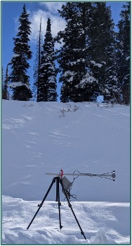

# pyro-pi AKA MOBILE-PI

This station will be carried out to the field each time to collect 1-min temp, RH, and upward/downward SW radiation. The purpose is to have a continuous datastream while we are at the field site.

